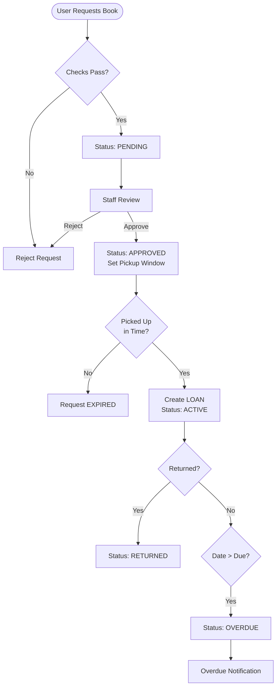

# University Library Management System (LMS)

A Django-based Library Management System for handling book loans, loan requests, notifications, and fines with role-based dashboards.

---

## Key Features

### Book, Author, and Member Management
- Book inventory with availability tracking and categories.
- Author and category browsing with HTML and JSON responses.
- Member profiles linked to user accounts.

### Loan Request Workflow
1. **Request**: Member submits a request and duration. The system validates availability, limits, and policy agreement.
2. **Review**: Staff approves or rejects requests. Approved requests get a pickup window.
3. **Notification**: Members receive approval/rejection and overdue notifications.

### Fines & Payments
- Overdue checks generate notifications via a management command.
- Fine payments update transaction status and can unlock borrowing.

---

## Architecture & Diagrams

### System Architecture


### Class Diagram (Models)


### Loan Process Flowchart


---

## Workflows & Logic

### Loan Request Validation
- Requested duration must be within the book's max loan duration.
- Member cannot request a book with an active loan or pending/approved request.
- Member must agree to the loan policy.
- Requests are blocked when the member has overdue loans with unpaid fines.

### Staff Review
- Approvals set `pickup_until` and `approved_at`.
- Notifications are sent for approval and rejection.

### Overdue Notifications
- `notify_overdue` scans active loans past `due_date` and notifiemembers.

---

## Tech Stack & Setup

- **Backend**: Django (Python)
- **Database**: SQLite (Default)
- **Frontend**: Django Templates, HTML/CSS
- **API**: Django REST Framework (HTML + JSON renderers)

### Installation
```bash
# Clone the repository
git clone <repo-url>
cd Django-gdg-project

# Install requirements (if available)
# pip install -r requirements.txt

# Apply database migrations
python my_first_project/lmsProject/manage.py makemigrations
python my_first_project/lmsProject/manage.py migrate

# Create admin/staff accounts (optional helper command)
python my_first_project/lmsProject/manage.py create_roles

# Run server
python my_first_project/lmsProject/manage.py runserver
```

### Management Commands
- `create_roles`: Creates or updates staff/admin accounts.
- `expire_loans`: Expires approved requests past pickup window.
- `notify_overdue`: Sends notifications for overdue active loans.

---

## Project Structure
- `lmsApp/models.py`: Core database models (`Book`, `Member`, `Loan`, `LoanRequest`, `Transaction`).
- `lmsApp/AccountView.py`: Auth + dashboard routing.
- `lmsApp/bookViews.py`, `lmsApp/authorViews.py`: Book/author pages and API responses.
- `lmsApp/memberLoanRequestViews.py`, `lmsApp/staffLoanRequestView.py`: Loan request lifecycle and staff tools.
- `lmsApp/management/commands/`: Operational jobs for roles, expirations, and overdue notices.

---
This README reflects the current implementation and will evolve as features expand.
